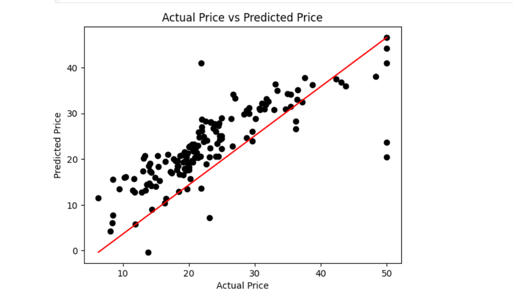

# House Price Prediction using Linear Regression

A machine learning project that predicts house prices using **Linear Regression** and the **Boston Housing dataset**.

## 📌 Project Overview

This project applies a supervised machine learning approach to predict house prices based on multiple features from the Boston Housing dataset.

The workflow includes:

**Data Loading → Data Exploration → Data Quality Checks → Feature/Target Separation → Train-Test Split → Linear Regression → Model Evaluation → Prediction Visualization**

## 📊 Dataset

The project uses the **Boston Housing dataset** from the UCI Machine Learning Repository.

The dataset contains **505 rows and 14 columns** after loading.

The target variable is:

- `MEDV` — Median value of owner-occupied homes

The remaining variables are used as input features for the prediction model.

## 🔎 Data Exploration & Preprocessing

The dataset was explored using:

- Dataset shape
- Statistical summary using `describe()`
- Missing-value analysis
- Duplicate-value analysis

The data quality checks showed:

- **0 missing values**
- **0 duplicate rows**

The target variable `MEDV` was separated from the input features before training the model.

## 🤖 Machine Learning Model

A **Linear Regression** model from Scikit-learn was used to predict house prices.

The dataset was divided into training and testing sets using a:

**70% Training / 30% Testing** split.

## 📈 Model Evaluation

The model was evaluated using the **R² (coefficient of determination)** score.

| Dataset | R² Score |
|---------|----------|
| Training | 0.7623 |
| Testing | 0.6667 |

The model was then used to generate predictions for the test dataset.

## 📊 Actual vs Predicted Prices

The predictions were visualized by comparing the actual house prices with the prices predicted by the Linear Regression model.



## 🛠️ Tools & Technologies

- Python
- Pandas
- NumPy
- Matplotlib
- Scikit-learn
- Jupyter Notebook

## 📁 Project Structure

```text
house-price-prediction-linear-regression/
│
├── README.md
├── requirements.txt
├── .gitignore
│
├── notebooks/
│   └── house_price_prediction.ipynb
```
🎯 Project Outcome

This project demonstrates a complete basic regression workflow, from exploring and preparing the dataset to training a Linear Regression model, evaluating its performance, and visualizing its predictions.
│
└── images/
    └── actual_vs_predicted.png
